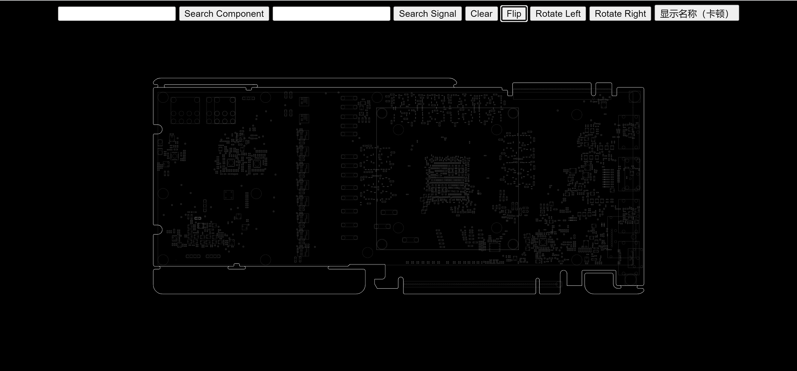
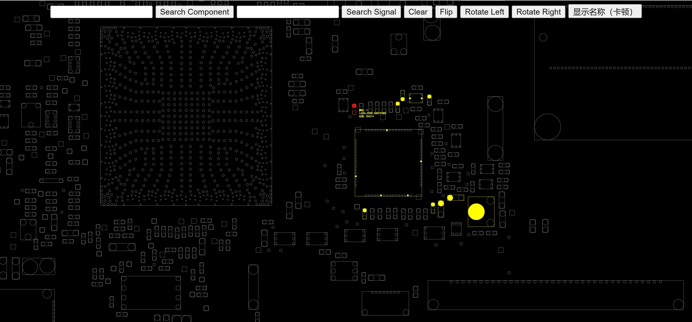
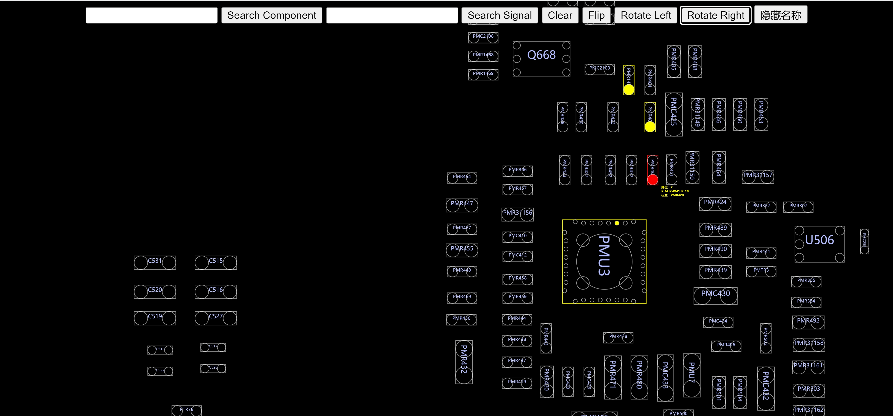

# Introduction

This project is a solution demo for my client. It demonstrated a compression upload technology implemented with JsZip and a simple algorithm allow user to scale at cursor's position while also being compatible with other original movement operations.

My client maintains a niche website to sells blueprints. The website allows users to browse blueprints online, but the speed of view page opening is very slow. After inspection, it was found that the reason is that the blueprint file is too large. The blueprints SVG code are saved in plain text on the server, approximately 7-10Mb each file. Each blueprint consists of front and back which is two file. Due to the 5M bandwidth limitation of the client's server, the download speed of TXT files is very slow. It takes around 10-30 seconds to open a blueprint in online viewer. This demo is mainly aimed at solving this problem by using compression upload technology. Server side now only store compressed version and doing compression\decompression operation on client side which  reduced bandwidth pressure significantly. The compressed individual files are kept within 1Mb, and the opening speed of view page now is controlled within 1 or 2 seconds, greatly improving the user experience. 

Besides that, I also kindly provided a simple viewer demo implemented by a few JQuery code to help fix their another issue：the previous implementation of scale at cursor's position function was inaccurate.

##### Demo Preview：

`demo can be view and try on: `http://194.26.213.249:9988/ `and `http://194.26.213.249:9988/admin

`username: `tester `password: `99999
